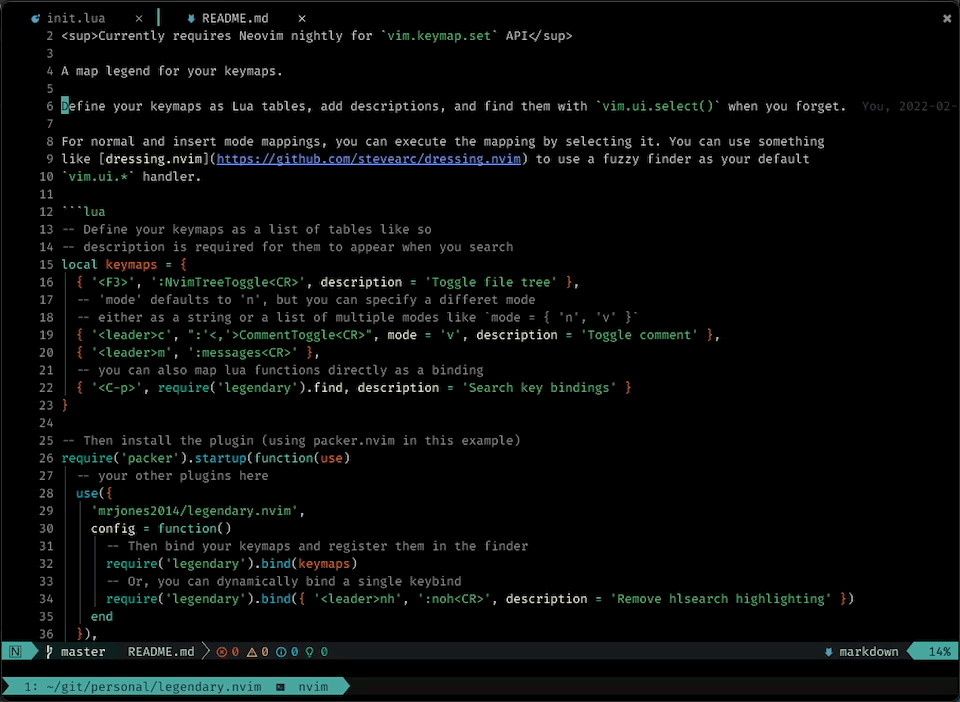

# legendary.nvim 🗺️

<sup>Currently requires Neovim nightly for `vim.keymap.set` API</sup>

A legend for your keymaps and commands 🗺️



Define your keymaps and commands as simple Lua tables and let `legendary.nvim` handle the rest.
Find them with `vim.ui.select()` when you forget.

It also includes built-in keymaps and commands (these can be removed via config). Please help
me add missing ones with a Pull Request!

For normal and insert mode mappings, you can execute the mapping by selecting it. You can use something
like [dressing.nvim](https://github.com/stevearc/dressing.nvim) to use a fuzzy finder as your default
`vim.ui.*` handler. Since it uses `vim.ui.select()`, it can pretty much support any fuzzy finder.

## Installation

With `packer.nvim`:

```lua
use('mrjones2014/legendary.nvim')
```

With `vim-plug`:

```VimL
Plug 'mrjones2014/legendary.nvim'
```

## Configuration

```lua
-- Define your keymaps as a list of tables like so
-- description is required for them to appear when you search
local keymaps = {
  { '<F3>', ':NvimTreeToggle<CR>', description = 'Toggle file tree' },
  -- 'mode' defaults to 'n', but you can specify a different mode
  -- either as a string or a list of multiple modes like `mode = { 'n', 'v' }`
  { '<leader>c', ":'<,'>CommentToggle<CR>", mode = 'v', description = 'Toggle comment' },
  { '<leader>m', ':messages<CR>' },
  -- you can also pass keymap options via the `opts` table, see `:h vim.keymap.set`
  -- and `:h nvim_set_keymap` for all available options
  -- default opts are `opts = { silent = true }`
  { '<leader>f', ':SomeMappingCommand', opts = { noremap = true, silent = false } },
  -- you can also map lua functions directly as a binding
  { '<C-p>', require('legendary').find, description = 'Search key bindings' },
  -- Or add a keybind without a definition (useful for reminding yourself of
  -- keybinds which are set up by plugins, for example, these nvim-cmp mappings)
  { '<C-d>', description = 'Scroll docs up' },
  { '<C-f>', description = 'Scroll docs down' },
}

local commands = {
  -- You can also use legendar.nvim to create commands!
  { ':CopyFileName', ':!echo % | pbcopy', description = "Copy current buffer's file name" },
  -- You can also set commands to run a lua function
  { ':DoSomethingWithLua', require('my_module').some_method, description = 'Do something with Lua!' },
  -- You can also define commands without an implementation
  -- this will simply make it appear in vim.ui.select() UI
  -- but will not create the command
  { ':CommentToggle', description = 'Toggle comment' },
  -- You can also have "unfinished" command (commands which need an argument)
  -- by setting `unfinished = true`. You can use `{arg_name}` or `[arg_name]`
  -- at the end of the string as a hint, this will get removed when inserted
  -- to the command line
  { ':MyCommand {some_argument}<CR>', description = 'Command with argument', unfinished = true },
  -- or
  { ':MyCommand [some_argument]<CR>', description = 'Command with argument', unfinished = true },
}

-- Then set up legendary.nvim
require('legendary').setup({
  -- Include builtins by default, set to false to disable
  include_builtin = true,
  -- Customize the prompt that appears on your vim.ui.select() handler
  select_prompt = 'Legendary',
  keymaps = keymaps,
  commands = commands,
})

-- Add an additional set of keybinds
-- (useful for binding LSP keybinds in the `on_attach` function, for example)
require('legendary').bind_keymaps({
  { 'gd', vim.lsp.buf.definition, description = 'Go to definition' },
  { 'gh', vim.lsp.buf.hover, description = 'Show hover information' },
  { 'gi', vim.lsp.buf.implementation, description = 'Go to implementation' },
})

require('legendary').bind_commands({
  { ':Format', vim.lsp.buf.formatting_sync, description = 'Format the document with LSP' },
})

-- Or, you can dynamically bind a single keybind or command
require('legendary').bind_keymap({ '<leader>nh', ':noh<CR>', description = 'Remove hlsearch highlighting' })
require('legendary').bind_command({ ':Format', vim.lsp.buf.formatting_sync, description = 'Format the document with LSP' })
```

## Usage

Trigger the legend with `require('legendary').find()`, `:Legend`, or `:Legendary`.
